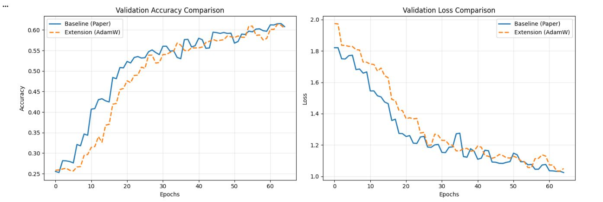

# Facial Expression Recognition using CNN

## Overview
This project implements a Convolutional Neural Network (CNN) for facial expression recognition using the FER-2013 dataset. The goal is to compare a baseline model with an extended version using advanced optimization techniques.

---

## Key Features
- CNN-based architecture for emotion classification
- Comparison between baseline and improved model
- Use of AdamW optimizer
- Cosine annealing learning rate scheduling
- Warm-up strategy for stable training

---

## Results

### Validation Performance

### Metrics
- Baseline Accuracy: 0.6261  
- Baseline F1 Score: 0.6103  
- Extended Accuracy: 0.6099  
- Extended F1 Score: 0.5934  

---

## Files
- `fer_cnn_project.ipynb` → Full implementation
- `validation_comparison.png` → Training results visualization
- `poster.jpg` → Project presentation
- `results.txt` → Final evaluation metrics

---

## Tech Stack
- Python
- TensorFlow / Keras
- Matplotlib
- NumPy

---

## Author
Sufyan Ismail
